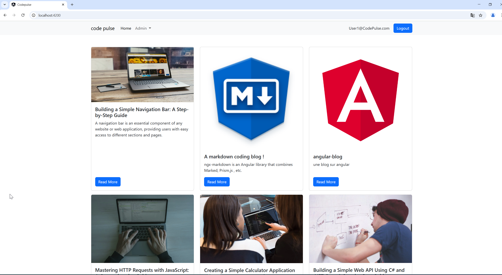

# CodePulse.API

### utilise
* VS2022
* .NET 9 (C# Web APIs avec ASPNET Core)
* SQLITE
* Serilog
* Http(s): Méthodes Web HTTP comme GET, POST, PUT, DELETE
* Injection de dépendance 
* Opérations CRUD dans ASP.NET Core (Créer, Lire, Mettre à jour, Supprimer)
* Entity Framework Core pour se connecter à la base de données SQLITE 
* Modèles de conception pilotés par le domaine (DDD)
* Authentification et autorisation
* Jetons JWT
* Autorisation basée sur les rôles
* Téléchargement d’images dans ASP.NET API Web de base
* et du code propre et réutilisable

## swagger

{
  "email": "User1@CodePulse.com",
  "password": "User1@123"
}

# CodePulse.UI

### utilise
* Angular 18.2.0
* Typscript
* Boostrap CSS
* Authentication et Authorization avec JSON web Tokens (JWT Tokens)
* Role based Authorization
* RxJs Observables, Subjects and Subscriptions
* Angular Auth Guards, Interceptors etc
* Angular CLI
* Angular Components
* Angular Routing
* Angular Services
* HTTP
* CORS
* Créer des composants réutilisables
* Opérations CRUD (Créer, Lire, Mettre à jour, Supprimer)
* Formes angulaires
* Aperçu Markdown en direct
* Markdown en HTML
* Authentification et autorisation
* JWT Tokens and Storage
* Cookie Services
* Local Storage
* Interceptors
* Auth/Route Guards
* Image Upload in Angular applications
* Models and Interfaces

## Codepulse

## login

## navbar

## categories

## edit categories

## blog post list

## edit blogpost

